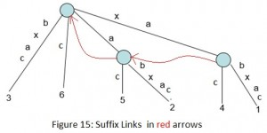

#String Matching
##Suffix Tree
###Some Concepts

- For `SuffixNode`

`self.children_dict`:
the key is an character, the value is a corresponding child node


`self.suffix_idx`: 
This will be non-negative for leaves and will give index of suffix for the path from root to this leaf. 
For non-leaf node, it will be -1.

- For `InEdgeLabel`

`self.start_idx`:
start idx, which is a value type

`self.end_idx_ref`:
end idx, which is a reference type

- [suffix_tree.py](suffix_tree.py)

###Suffix Link

[geeksforgeeks suffix link tutorial link](http://www.geeksforgeeks.org/ukkonens-suffix-tree-construction-part-2/)



> For an internal node v with path-label xA, where x denotes a single character and A denotes a (possibly empty) substring, if there is another node s(v) with path-label A, then a pointer from v to s(v) is called a suffix link.
If A is empty string, suffix link from internal node will go to root node.
There will not be any suffix link from root node (As it’s not considered as internal node).

> In extension j of some phase i, if a new internal node v with path-label xA is added, then in extension j+1 in the same phase i:
        
> Either the path labelled A already ends at an internal node (or root node if A is empty)
OR a new internal node at the end of string A will be created
In extension j+1 of same phase i, we will create a suffix link from the internal node created in jth extension to the node with path labelled A.

###Questions

[geeksforgeeks suffix tree tutorial link](http://www.geeksforgeeks.org/ukkonens-suffix-tree-construction-part-6/)


> This data structure will answer to the required queries quickly as below:

> How to check if a node is root ? — Root is a special node, with no parent and so it’s start and end will be -1, for all other nodes, start and end indices will be non-negative.

> How to check if a node is internal or leaf node ? — suffixIndex will help here. It will be -1 for internal node and non-negative for leaf nodes.

> What is the length of path label on some edge? — Each edge will have start and end indices and length of path label will be end-start+1

> What is the path label on some edge ? — If string is S, then path label will be substring of S from start index to end index inclusive, [start, end].

> How to check if there is an outgoing edge for a given character c from a node A ? — If A->children[c] is not NULL, there is a path, if NULL, no path.

> What is the character value on an edge at some given distance d from a node A ? — Character at distance d from node A will be S[A->start + d], where S is the string.

> Where an internal node is pointing via suffix link ? — Node A will point to A->suffixLink

> What is the suffix index on a path from root to leaf ? — If leaf node is A on the path, then suffix index on that path will be A->suffixIndex


##Z-Algorithm
- text and pattern

```python
pat = 'aba'
txt = 'bbabaxababay'
```

- [z_algorithm.py](z_algorithm.py)

- output

```zsh
naive: [2, 6, 8]
z algorithm: [2, 6, 8]
```